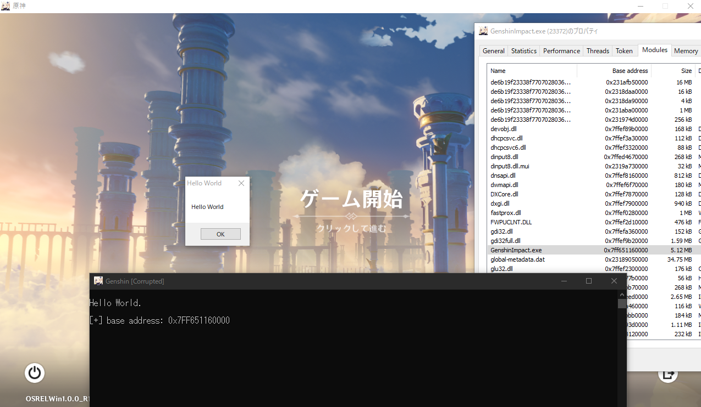
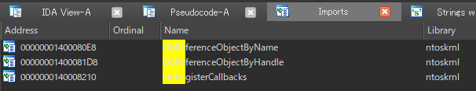

# Genshin-Bypass
An Anti-Cheat Bypass for Genshin Impact that allows you to inject ANY dlls into the protected game.

# Overview

The Genshin installs KernelMode Driver named `"mhyprot2"` to protect its process under a privileage of Windows Kernel.  
So there is nothing we can do from the user-mode usually, except abusing exploits.

In this project, I choose [libelevate](https://github.com/notscimmy/libelevate) which provides handle elavation for ANY processes, using [libcapcom](https://github.com/notscimmy/libcapcom).  
Also the libcapcom provides code execution on kernel which makes us advantage in this fight, against kernel mode drivers.

Because mhyprot2 just hides its process handle by `ObRegisterCallbacks`.  
After the work finishes, driver will be unloaded, therefore there are no real-time protections as of now.

# Analysis

### The `"mhyprot2"` registers:

- **`PsSetCreateProcessNotifyRoutineEx`**
- **`PsSetLoadImageNotifyRoutine`**
- **`PsSetCreateThreadNotifyRoutine`**

### The `"mhyprot2"` does:

- Observing for `csrss.exe` injection.
- Remove process/thread object from all handle tables.
- Write logs into `c:\windows\kmlog.log`

We can confirm that the driver removes handle from all of tables, as follows:  
(hardcoded codes are omitted)

```cpp
bool __fastcall RemoveHandleFromHandleTable(__int64 a1, __int64 a2, __int64 a3)
{
  char rtlOsVersionInfo; // [rsp+20h] [rbp-128h]
  unsigned int v5; // [rsp+2Ch] [rbp-11Ch]
  __int64 pEProcess; // [rsp+150h] [rbp+8h]

  switch ( dword_14000A748 )
  {
    case 61:                                    // Windows 7
      break;
    case 62:                                    // Windows 8
      goto LABEL_15;
    case 63:                                    // Windows 8.1
LABEL_15:
      break;
    case 100:                                   // Windows 10
      RtlGetVersion(&rtlOsVersionInfo);
      if ( v5 >= 0x4A61 ) {
LABEL_9:
        break;
      }
      if ( v5 >= 0x47BA ) {
        goto LABEL_9;
      }
      if ( v5 < 0x3AD7 ){}
      else {}
      break;
  }
  pEProcess = 0i64;
  PsLookupProcessByProcessId(4i64, &pEProcess, a3); // pid 4 is system process
  return sub_140003D08(pEProcess) == 4;
}
```


